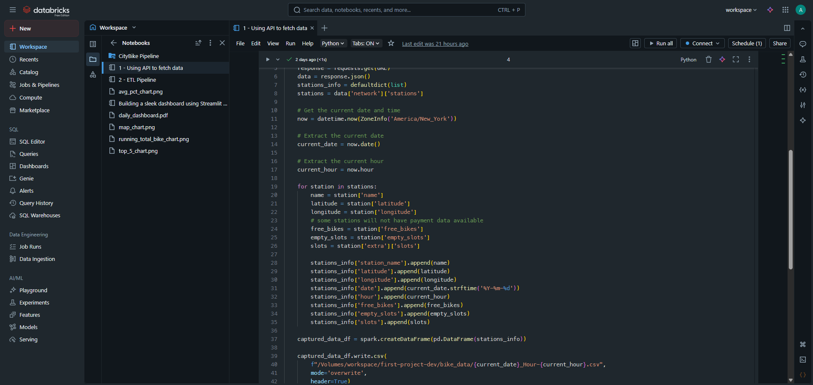
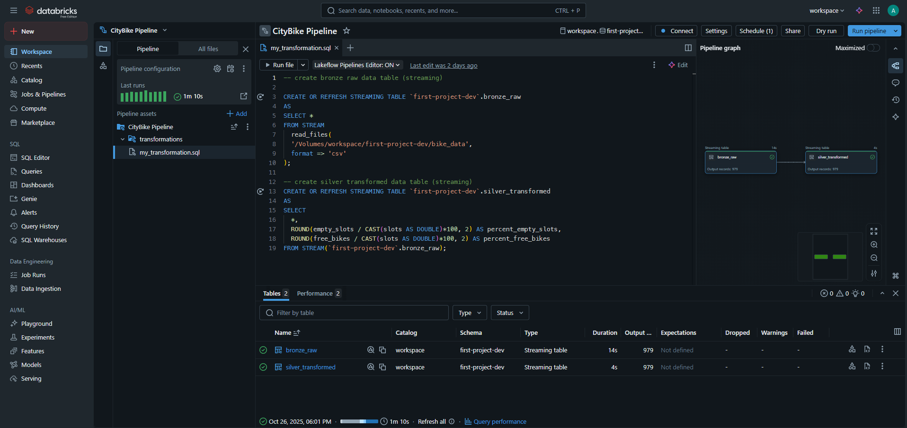
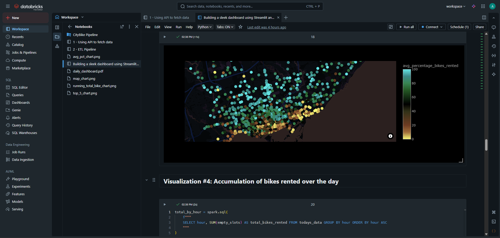

# Welcome to my Toronto CityBike data engineering project!
Following my completion of the IBM Data Engineering Certificate (and with it the included Capstone Project), I figured I would go hands-on in learning one of the most popular cloud-based data engineering tools right now - Databricks. It's got some really neat and useful features, which we'll cover in more detail as we dive more in-depth into the stages of the project and their specifics.

# What is Databricks?
Since it doesn't make sense to start using a tool before you've gotten to know about it and what it does, so what exactly is Databricks?
 
 
Databricks, at its highest level, is a cloud-based data engineering tool that is best described as an all-in-one. Whereas traditionally, data engineers would have to juggle multiple different softwares and platforms to bring data from several disparate sources into one unified lake/warehouse environment, Databricks provides a refreshing one-size-fits-all approach. From complementary SQL warehouses, to multiple data connectors that make it easy to get your data, wherever it may be stored, and even orchestration tools that help you design and automate processes, Databricks is almost like the hack that you wish you started using sooner.

# The Project Stages
Now, let's break the project down into its core components:

## Stage 1: Fetching CityBike bike rental data
I wanted a pipeline that would extract and store bike rental data from every hour of the day, and at the end of the day, send an email with a dashboard attached that contained an overall view of the day's bike metrics. Thus, I started with the data collection stage: how would I actually get my hands on bike rental data? For this, I used [the CityBikes API](https://docs.citybik.es/api/v2). I then isolated the URL that would allow me to access Toronto's bike rental data. From there, I parsed the JSON response object to extract only the information I would be interested in receiving dashboards on. Information such as:
- station location
- number of bikes rented at that point in time
- number of docking station at that particular location

<em>Note: this project does not provide instantaneous real-time analytics, and intentionally so. The purpose of this project was not to provide a live, up-to-date dashboard of bike rentals that was precise to the minute, but rather to familiarize myself with the Databricks platform and its features. I also took this approach to save on compute load, as I am currently using the free edition of Databricks</em>

<figure>
    
    <figcaption>Code snippet from data collection script</figcaption>
</figure>

[Full script](../main/scripts/1%20-%20Using%20API%20to%20fetch%20data.py)

## Stage 2: Defining ETL pipeline
After we've figured out how to collect the data, we should set up a pipeline that automatically reads in new data when it's placed by the data collection script, and then automatically updates the required tables with the new data. To do this, we'll leverage Databricks' medallion architecture; we'll load the raw data into a bronze table, and then transform/clean it into a silver table. Both of these tables will be streaming tables, which automatically update when Databricks detects new data in the source. For the bronze table, we will set things up so that whenever there is new data in the location where the collection script saves it, the table will ingest this new data. The silver table, in turn, ingests any new data from the bronze table, and performs the necessary transformations

<figure>
    
    <figcaption>Screenshot of ETL SQL code</figcaption>
</figure>

[SQL code](../main/scripts/my_transformation.sql)

## Stage 3: Sending email with dashboard
Next, we create a script to send an email to ourselves, with the information contained in the dashboard. The email contains four visualizations and one metric:
- bikes rented (total)
- average percentage of station capacity rented by station (map)
- top 5 stations by bikes rented
- line chart of average percentage of station capacity rented by hour
- running total of bikes rented progressing over time by hour

<figure>
    
    <figcaption>Code snippet of script that sends email</figcaption>
</figure>

[Full script](../main/scripts/Building%20a%20sleek%20dashboard%20using%20Streamlit%20and%20Altair.py)

## Stage 4: Automation of tasks
Finally, we will make use of Databricks' Jobs feature, which allows us to orchestrate tasks to run automatically and in a particular order. Since we have two different processes that we want to run at different time intervals (one every hour, and another every day), we will run two jobs:
- Job 1 - Collection script runs, then the ETL pipeline runs
- Job 2 - Script to send email
